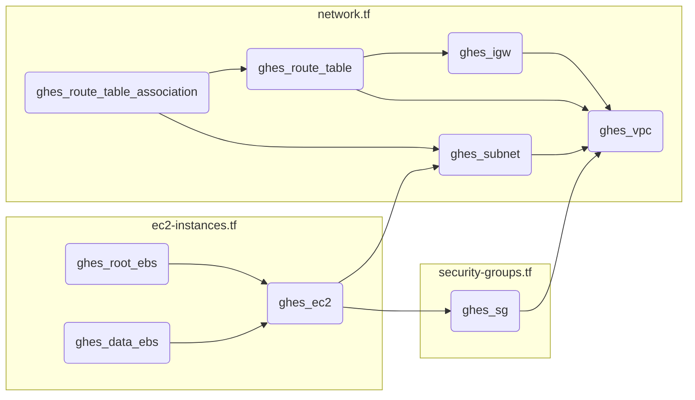

# terraform-ghes

Spin up a GitHub Enterprise Server (GHES) instance in AWS using Terraform.

## Architecture



## Usage

* Create a `terraform.tfvars` file with the following variables:

```hcl
owner = "myorg"
aws_region = "eu-west-3"
aws_availability_zone = "eu-west-3a"
aws_instance_type = "m5.4xlarge"
key_pair_name = "mykeypair"
ghes_version = "3.8.11"
root_volume_size = 200
data_volume_size = 150
```

Available GHES versions can be found [here](https://enterprise.github.com/releases)

Technical prerequisites can be found [here](https://docs.github.com/en/enterprise-server@3.10/admin/installation/setting-up-a-github-enterprise-server-instance/installing-github-enterprise-server-on-vmware#minimum-requirements)

* Run Terraform:

```hcl
cd aws
export AWS_ACCESS_KEY_ID="anaccesskey"
export AWS_SECRET_ACCESS_KEY="asecretkey"
ssh-keygen -t rsa
terraform init
terraform plan
terraform apply -auto-approve
```

* Read public ip and useful information from the output:

```hcl
ghes_homepage = "https://35.180.134.22"
ghes_setup_endpoint = "https://35.180.134.22:8443/setup"
ghes_ssh_command = "ssh -i ~/.ssh/mykeypair.pem -p 122 admin@35.180.134.22"
```