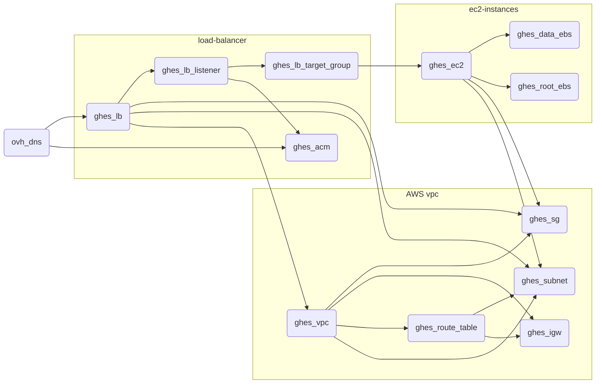

# terraform-ghes

Spin up a GitHub Enterprise Server (GHES) instance in AWS using Terraform.

## Architecture



## Usage

* Create a `terraform.tfvars` file with the following variables:

```hcl
owner                 = "tdupoiron"
aws_region            = "eu-west-3"
aws_availability_zones = ["eu-west-3a", "eu-west-3b", "eu-west-3c"]
aws_instance_type     = "m5.8xlarge"
ghes_version          = "3.10.3"
root_volume_size      = 200
data_volume_size      = 200

ovh_domain_name       = "dupoiron.com"
ghes_domain_name      = "ghes.dupoiron.com"
```

Available GHES versions can be found [here](https://enterprise.github.com/releases)

Technical prerequisites can be found [here](https://docs.github.com/en/enterprise-server@3.10/admin/installation/setting-up-a-github-enterprise-server-instance/installing-github-enterprise-server-on-vmware#minimum-requirements)

* Run Terraform:

```hcl
export AWS_ACCESS_KEY_ID="anaccesskey"
export AWS_SECRET_ACCESS_KEY="asecretkey"

export OVH_CONSUMER_KEY="a consumer key"
export OVH_APPLICATION_KEY="an application key"
export OVH_APPLICATION_SECRET="an application secret"
ssh-keygen -q -t rsa -N '' -f ~/.ssh/id_rsa <<<y >/dev/null 2>&1

cd aws
terraform init -backend-config=backend.conf
terraform plan;terraform apply -auto-approve
```

* Read public ip and useful information from the output:

```hcl
ghes_homepage = "https://35.180.134.22"
ghes_setup_endpoint = "https://35.180.134.22:8443/setup"
ghes_ssh_command = "ssh -i ~/.ssh/mykeypair.pem -p 122 admin@35.180.134.22"
```

* Destroy the infrastructure:

```hcl
export AWS_ACCESS_KEY_ID="anaccesskey"
export AWS_SECRET_ACCESS_KEY="asecretkey"
ssh-keygen -q -t rsa -N '' -f ~/.ssh/id_rsa <<<y >/dev/null 2>&1

cd aws
terraform init -backend-config=backend.conf
terraform destroy -auto-approve
```

## Connect to the instance

* Download the private key from GitHub Actions artifacts

or

* Add your public key to the instance using the management console

* Connect to the instance using the ssh command from the output

```shell
ssh -p 122 admin@ghes.domain.com -i $HOME/.ssh/public_key
```

## Configure Let's Encrypt certificate

* Enable ACME protocol on the instance and issue a certificate

```shell
ghe-ssl-acme -e
```
